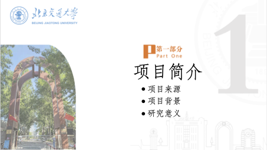
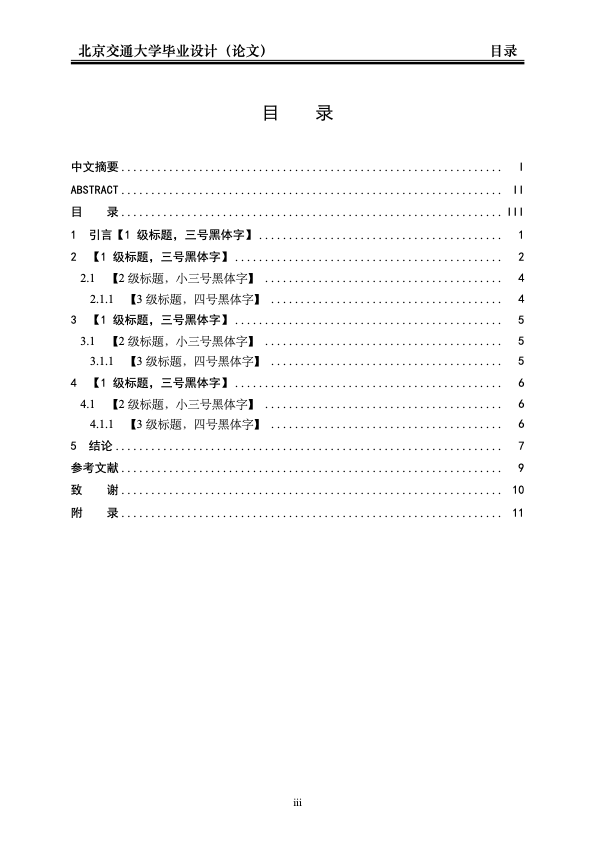
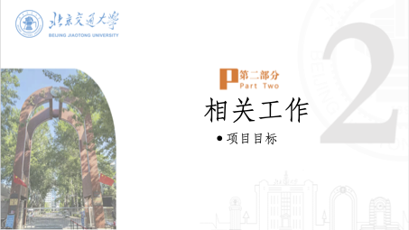
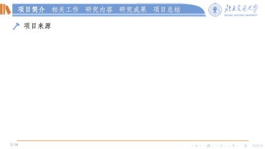

<h1 align="center">
  
   
  北京交通大学 Beamer 主题
</h1>

Beamer Theme for Beijing Jiaotong University

## 📝 repo 介绍

BJTUBeamer 主题为作者基于本科毕业设计中使用的 PPT 模板制作，旨在提供对应风格的 Beamer 制作方式，可用于学位答辩、课堂演示、学术交流或其他需要演示文稿 的活动，方便地使用 LaTeX 制作含有学校特色的演示文稿。

## 📑 使用说明

1. 下载这个项目的 zip 包到到本地
2. 直接对 bjtubeamer/main.tex 文件进行修改
3. 请使用XeLaTeX编译
4. *make samplebib & Enjoy*

## 📁 文件结构

  
BJTU-Beamer

    

        
bjtubeamer

- beamerthemebjtubeamer.sty 演示主题
- beamerinnerthemebjtubeamer.sty 内部主题
- beamerouterthemebjtubeamer.sty 外部主题
- beamercolorthemebjtubeamer.sty 色彩主题
- beamerfontthemebjtubeamer.sty 字体主题
- resources 主题相关素材
- figures 插图
- main.tex 
- main.pdf
- bjtubeamer.tex
- bjtubeamer.pdf 用户手册

    

    

        
sample

slide 排版样例
    

|       |                 展示                  |                       展示                       |
  |:-----------------------------------:|:----------------------------------------------:| :-----------------------------------------------: |
  | 预览  |  |      |
  | 说明  |                 封面页                 |                    章节封面（1）                     |
  | 文件  |            `\makecover`             |                  `\section{}`                  |
  | 预览  |  |      |
  | 说明  |                 目录页                 |                    章节封面（2）                     |
  | 文件  |           `\makecontent`            |                  `\section{}`                  |
  | 预览  |          |        |
  | 说明  |                 内容帧                 |                    章节封面（3）                     |
  | 文件  |    `\begin{frame}……\end{frame}`     |                  `\section{}`                  |
  | 预览  |  |  |
  | 说明  |                 封底                  |                    章节封面（4）                     |
  | 文件  |          `\makebackcover`           |                  `\section{}`                  |
  | 预览  |          |         |
  | 说明  |             Beamer 主题预览             |                    章节封面（5）                     |
  | 文件  |             `main.pdf`              |                  `\section{}`                  |
